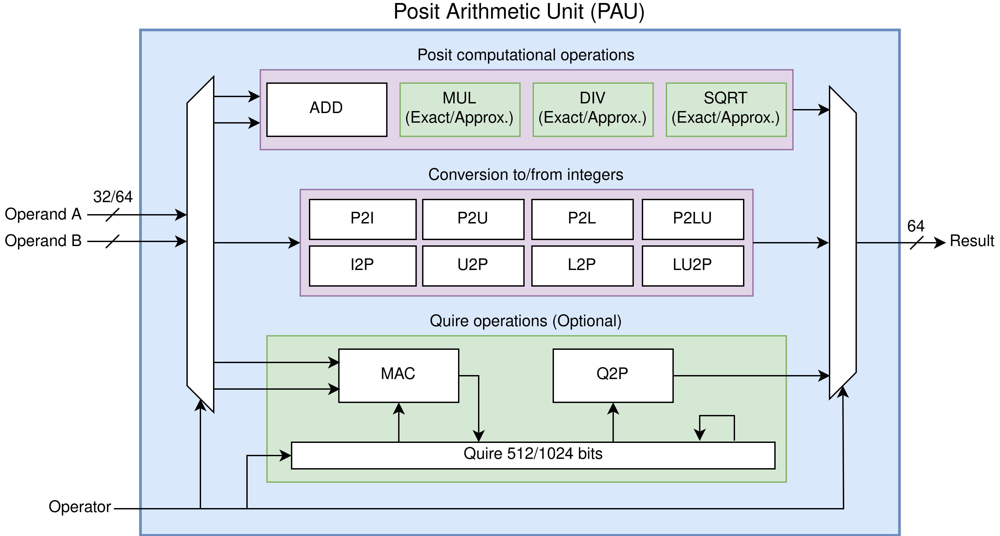

# PERCIVAL: Open-Source Posit RISC-V Core with Quire Capability

PERCIVAL is an application-level posit capable RISC-V core based on CVA6 that can execute all posit instructions, including the quire fused operations.

You can find the Xposit RISC-V custom extension for posit arithmetic used together with this repository here: https://github.com/artecs-group/llvm-xposit

You can find the original CVA6 repo with additional documentation here: https://github.com/openhwgroup/cva6

# 64-bit version (Big-PERCIVAL)
Here you can also find Big-PERCIVAL, an updated version of PERCIVAL which adds posit64 operations and increased flexibility in the PAU. You can read about it in our pre-print: https://doi.org/10.48550/arXiv.2305.06946

For the original PERCIVAL code switch to the `posit-master` branch. However, we recommend using the current default `big-percival-main` branch, as this also supports 32-bit posits.

## Publication

If you use PERCIVAL in your academic work you can cite us:

D. Mallasén, R. Murillo, A. A. D. Barrio, G. Botella, L. Piñuel, and M. Prieto-Matias, “PERCIVAL: Open-Source Posit RISC-V Core With Quire Capability,” IEEE Transactions on Emerging Topics in Computing, vol. 10, no. 3, pp. 1241–1252, 2022, doi: 10.1109/TETC.2022.3187199.

D. Mallasén, A. A. Del Barrio, and M. Prieto-Matias, “Big-PERCIVAL: Exploring the Native Use of 64-Bit Posit Arithmetic in Scientific Computing.” arXiv [cs.AR], 2023. Available: http://arxiv.org/abs/2305.06946

```
@article{mallasen2022PERCIVAL,
  title = {PERCIVAL: Open-Source Posit RISC-V Core With Quire Capability},
  author = {Mallasén, David and Murillo, Raul and Del Barrio, Alberto A. and Botella, Guillermo and Piñuel, Luis and Prieto-Matias, Manuel},
  year = {2022},
  journal = {IEEE Transactions on Emerging Topics in Computing},
  volume = {10},
  number = {3},
  pages = {1241-1252},
  issn = {2168-6750},
  doi = {10.1109/TETC.2022.3187199}
}

@misc{mallasen2023BigPERCIVAL,
  title = {Big-PERCIVAL: Exploring the Native Use of 64-Bit Posit Arithmetic in Scientific Computing},
  author = {Mallasén, David and Del Barrio, Alberto A. and Prieto-Matias, Manuel},
  year = {2023},
  month = may,
  eprint = {2305.06946},
  primaryclass = {cs.AR},
  archiveprefix = {arXiv}
}
```

## Posit Arithmetic Unit (PAU)

The top-level module of the PAU can be found in `core/pau_top.sv`. The individual arithmetic modules are in `core/pau/`. You can configure the PAU changing the parameters in `core/include/ariane_pkg.sv`.



## Getting Started

The following instructions will get you a copy of the project up and running on your local machine and run the posit testsuite using the QuestaSim simulator. If you run into problems, look at the [troubleshooting](#troubleshooting-the-installation) section.

### Prerequisites
These instructions assume you have the [LLVM Xposit](https://github.com/artecs-group/llvm-xposit) compiler and the QuestaSim simulator installed in your system. Also, on a fresh Ubuntu 20.04 installation you will need to install the following packages:
~~~
sudo apt install -y git curl gcc g++ make autoconf
~~~
Make sure you have the $RISCV environment variable pointing to the directory where you installed the RISC-V gcc toolchain. E.g. `export RISCV="/opt/riscv`. Consider adding this permanently in your `.bashrc` file.

### Checkout the repository
~~~
git clone https://github.com/artecs-group/PERCIVAL.git
cd PERCIVAL
git submodule update --init --recursive
~~~

~~~
mkdir tmp
./ci/install-riscvpk.sh
~~~

### Compile the posit testsuite
~~~
clang --target=riscv64 -march=rv64gcxposit posit64_testsuite_llvm.c -c -o posit64_testsuite_llvm.o
riscv64-unknown-elf-gcc posit64_testsuite_llvm.o -o posit64_testsuite_llvm.elf
~~~

### Simulate the posit testsuite
~~~
make sim elf-bin=$RISCV/riscv64-unknown-elf/bin/pk target-options=posit64_testsuite_llvm.elf batch-mode=1
~~~
Note: If you want to use the QuestaSim GUI, remove the `batch-mode=1` option.

### Troubleshooting the installation

If QuestaSim does not find the `libfesvr.so`, you can generate it by running the `./ci/install-fesvr.sh` script. If it still doesn't generate the library, add the line `fesvr_install_shared_lib = yes` to the `./tmp/riscv-isa-sim/fesvr/fesvr.mk.in` file and follow the `./ci/install-fesvr.sh` script instructions manually.

If QuestaSim fails with the following error: `Fatal: Unexpected signal: 11`, run with:
~~~
make sim elf-bin=posit64_testsuite_llvm.elf QUESTASIM_FLAGS="-novopt -suppress 12110" batch-mode=1
~~~
This fix follows the instructions [here](https://github.com/openhwgroup/cva6/issues/800#issuecomment-1081757665). It should be fixed with newer versions of QuestaSim (2022.4 or later).

## FPGA Synthesis

To generate the FPGA bitstream for the Genesys II board run `make fpga`. This will produce a bitstream file and memory configuration file in `corev_apu/fpga/work-fpga/`.

### Programming the Memory Configuration File
1. Open Vivado.
2. Open the Hardware Manager and open the target board (Genesys II `xc7k325t`).
3. Tools -> Add Configuratin Memory Device -> `xc7k325t`.
4. Select Configuration Memory Part -> Spansion SPI flash `s25fl256sxxxxxx0`.
5. Program the configuration memory device with the configuration file `ariane_xilinx.mcs` generated in `corev_apu/fpga/work-fpga/`.
6. Press ok. Flashing will take a couple of minutes.
7. Right click on the FPGA device -> Boot from Configuration Memory Device (or press the program button on the FPGA).

## Booting linux

To prepare the SD card and boot linux follow the instructions available [here](https://github.com/openhwgroup/cva6/blob/master/README.md#preparing-the-sd-card).
You can build your own posit applications and include them in the linux image following the instructions available [here](https://github.com/openhwgroup/cva6-sdk).

## Acknowledgments
This work was supported in part by the 2020 Leonardo Grant for Researchers and Cultural Creators, from BBVA Foundation under Grant PR2003_20/01, in part by the Spanish MINECO, the EU(FEDER), and Comunidad de Madrid under Grants RTI2018-093684-B-I00 and S2018/TCS-4423, and in part by grants PID2021-123041OB-I00 and PID2021-126576NB-I00 funded by MCIN/AEI/ 10.13039/501100011033 and by “ERDF A way of making Europe”.
